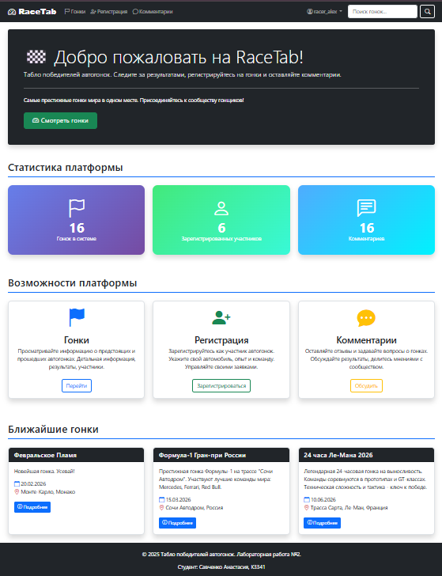
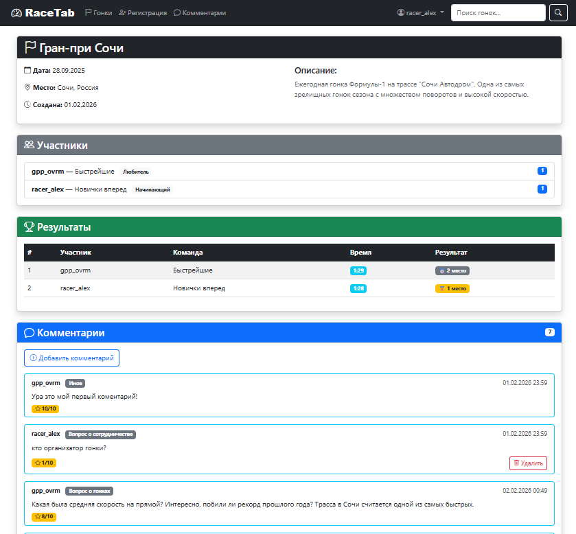
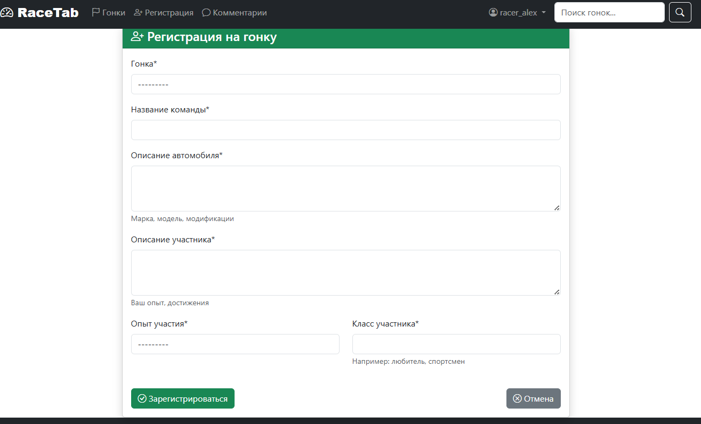

# Лабораторная работа 2. Реализация простого сайта на Django

## Цель

Овладеть практическими навыками и умениями реализации web-сервисов средствами Django 2.2.

## Практическое задание

Реализовать сайт используя фреймворк Django 3 и СУБД PostgreSQL *, в соответствии с вариантом задания лабораторной
работы.

## Для получения максимального балла

Чтобы продлить срок, необходимо:

1. **Реализовать меню** (меню с бутсрап - https://www.youtube.com/watch?v=HEPTgggsRgY)
2. **Реализовать пагинацию страниц** (так себе вариант - https://evileg.com/ru/post/10/ , отличный
   вариант - https://evileg.com/ru/post/237/)
3. **Внедрить поиск по объектам**, с которыми настроена пагинация (https://evileg.com/ru/post/21/)

## Требования

1. Голый HTML это грустно и некрасиво. Если хотите получать максимальный балл, то разукрасьте свой мир с помощью ксс-ки
   и верстки. ChatGPT или любая другая LLM в помощь.
2. Внимательно отнеситесь к последнему заданию-пункту в каждом варианте. Концепция заключается в том, чтобы на стороне
   клиента (не админки) было разделение прав админа и юзера, чтобы админ мог видеть и делать больше чем пользователь
3. Подумайте немного над вашей моделью данных. Будет ли ее удобно использовать если бы это был ваш маленький пет-проект?
4. В тексте лабы на гите так же описано что на максимальный балл надо реализовать пагинацию и фильтрацию. Не забывайте
   про этот пункт

## Вариант 6: Табло победителей автогонок

Табло должно отображать информацию об участниках автогонок:

- ФИО участника
- Название команды
- Описание автомобиля
- Описание участника
- Опыт и класс участника

### Необходимо реализовать следующий функционал:

1. **Регистрация новых пользователей**
2. **Просмотр автогонок и регистрацию гонщиков.** Пользователь должен иметь возможность редактирования и удаления своих
   регистраций
3. **Написание отзывов и комментариев к автогонкам.** Предварительно комментатор должен зарегистрироваться. При
   добавлении комментариев должны сохраняться:
    - Даты заезда
    - Текст комментария
    - Тип комментария (вопрос о сотрудничестве, вопрос о гонках, иное)
    - Рейтинг (1-10)
    - Информация о комментаторе
4. **Администратор должен иметь возможность указания времени заезда и результата средствами Django-admin**
5. **В клиентской части должна формироваться таблица всех заездов и результатов конкретной гонки**

## Описание реализации

### Структура проекта

Проект реализован на Django 6.0.1 (+ django-bootstrap3==26.1) с использованием SQLite для хранения данных.

Структура проекта организована следующим образом:

```
laboratory_work_2/
├── db.sqlite3                     # База данных SQLite 
├── manage.py                      # Основной файл управления Django
├── requirements.txt               # Зависимости проекта 
│
├── raceapp/                       # Основное приложение 
│   ├── migrations/                # Миграции базы данных 
│   │   └── __pycache__/          # Кэш Python
│   │
│   ├── templates/raceapp/         # Шаблоны приложения 
│   │   ├── add_comment.html       # Форма добавления комментария 
│   │   ├── comment_list.html      # Список всех комментариев 
│   │   ├── edit_profile.html      # Редактирование профиля 
│   │   ├── home.html             # Главная страница 
│   │   ├── login.html            # Страница входа 
│   │   ├── logout.html           # Страница выхода 
│   │   ├── my_registrations.html # Мои регистрации на гонки 
│   │   ├── profile.html          # Профиль пользователя 
│   │   ├── racer_register.html   # Регистрация на гонку 
│   │   ├── race_detail.html      # Детали гонки 
│   │   ├── race_list.html        # Список всех гонок 
│   │   ├── register.html         # Регистрация пользователя 
│   │   ├── registration_delete.html # Удаление регистрации 
│   │   ├── search_results.html   # Результаты поиска 
│   │   └── registration_update.html # Редактирование регистрации
│   │
│   ├── __pycache__/              # Кэш Python 
│   ├── admin.py                  # Настройка админ-панели 
│   ├── apps.py                   # Конфигурация приложения (создан автоматически)
│   ├── forms.py                  # Формы Django 
│   ├── models.py                 # Модели базы данных 
│   ├── tests.py                  # Тесты (автоматически, пустые)
│   ├── urls.py                   # Маршруты приложения 
│   ├── views.py                  # Обработчики запросов
│   └── __init__.py               # Инициализация приложения (создан автоматически)
│
├── racetab/                       # Настройки проекта (созданы автоматически)
│   ├── __pycache__/              # Кэш Python 
│   ├── asgi.py                   # ASGI конфигурация 
│   ├── settings.py               # Настройки проекта 
│   ├── urls.py                   # Корневые маршруты 
│   ├── wsgi.py                   # WSGI конфигурация 
│   └── __init__.py               # Инициализация проекта 
│
├── static/                        
│   ├── css/
│   │   └── style.css             # css чтобы html не был совсем голым
│   ├── images/                   
│   └── js/                       
│
└── templates/                    
    └── base.html                 # Базовый шаблон (бутстрап, навигация, футер)
```

### 🔧 Техническая реализация

Проект построен по классической MVC-архитектуре Django с четким разделением ответственности между компонентами.

#### **Модели данных (models.py)**

Созданы следующие модели в `raceapp/models.py`:

- **User** - кастомная модель пользователя (расширяет AbstractUser)
- **Race** - модель гонки
- **Racer** - регистрация участника на гонку
- **RaceResult** - результаты заезда
- **Comment** - комментарии к гонкам

**Пример структуры модели Racer:**

``` python
class Racer(models.Model):
    EXPERIENCE_CHOICES = [
        ('beginner', 'Начинающий'),
        ('amateur', 'Любитель'),
        ('professional', 'Профессионал'),
    ]
    
    user = models.ForeignKey(User, on_delete=models.CASCADE, related_name='racers')
    race = models.ForeignKey(Race, on_delete=models.CASCADE, related_name='racers')
    
    class Meta:
        unique_together = ('user', 'race')  # Уникальность регистрации
```

**Анализ:** Использование `related_name` создает удобные обратные связи (например, `user.racers.all()`). Ограничение
`unique_together` предотвращает дублирование регистраций на уровне базы данных.

#### **Логика обработки запросов (views.py)**

**Пример реализации RaceListView с фильтрацией и пагинацией:**

``` python
class RaceListView(ListView):
    model = Race
    template_name = 'raceapp/race_list.html'
    paginate_by = 6

    def get_queryset(self):
        queryset = super().get_queryset()
        
        # Комбинированный поиск по нескольким полям
        search_query = self.request.GET.get('q')
        if search_query:
            queryset = queryset.filter(
                Q(name__icontains=search_query) |
                Q(description__icontains=search_query) |
                Q(location__icontains=search_query)
            )
        
        # Аннотации для статистики
        queryset = queryset.annotate(
            avg_rating=Avg('comments__rating'),
            comment_count=Count('comments')
        )
        return queryset
```

**Анализ:** Использование `Q` объектов позволяет создавать сложные запросы OR с поддержкой индексации. Аннотации `Avg` и
`Count` вычисляются на уровне базы данных, что значительно эффективнее чем обработка в Python.

#### **Формы и валидация (forms.py)**

**Пример формы регистрации пользователя:**

``` python
class CustomUserCreationForm(UserCreationForm):
    email = forms.EmailField(required=True, 
                           widget=forms.EmailInput(attrs={'class': 'form-control'}))
    
    class Meta:
        model = User
        fields = ('username', 'email', 'first_name', 'last_name', 
                  'password1', 'password2')
        widgets = {
            'username': forms.TextInput(attrs={'class': 'form-control'}),
        }
```

**Анализ:** Кастомные виджеты с Bootstrap классами обеспечивают единообразие интерфейса. ModelForm автоматически
генерирует HTML и выполняет валидацию на основе модели.

#### **Административный интерфейс (admin.py)**

**Пример админ-панели для гонщиков:**

``` python
class RacerAdmin(admin.ModelAdmin):
    list_display = ('user', 'race', 'team_name', 'experience')
    list_filter = ('experience', 'racer_class', 'race')
    raw_id_fields = ('user', 'race')  # Оптимизация производительности
```

**Анализ:** Использование `raw_id_fields` заменяет тяжеловесные SELECT на легкие текстовые поля для ForeignKey, что
критично для таблиц с тысячами записей.

### Реализованный функционал

#### 1. Аутентификация и авторизация

- Реализована регистрация новых пользователей с кастомной формой
- Система входа/выхода с использованием Django auth
- Разделение прав: пользователи, администраторы

**Защита доступа в views.py:**

``` python
@login_required
def my_registrations(request):
    # Только авторизованные пользователи
    pass

class RacerDeleteView(UserPassesTestMixin, DeleteView):
    def test_func(self):
        # Пользователь может удалять только свои записи
        return self.get_object().user == self.request.user
```

**Анализ:** Декоратор `@login_required` и миксин `UserPassesTestMixin` обеспечивают двухуровневую защиту. Проверка прав
в `test_func()` предотвращает несанкционированный доступ.

#### 2. Основные страницы

- **Главная страница** - статистика системы, ближайшие гонки

  - главная страница

- **Список гонок** - с пагинацией и фильтрацией

  Фильтрация по дате, типу комментария, рейтингу

  Поиск по названию гонок и тексту комментариев
    - страница гонок с фильтрами

- **Детали гонки** - информация о гонке, участники, результаты, комментарии

   - страница деталей о гонке

- **Регистрация на гонку** - форма для регистрации участника



- **Мои регистрации** - управление своими заявками


- **Комментарии** - просмотр всех комментариев системы

#### 3. Пагинация и фильтрация

- Пагинация реализована на странице комментариев

 - страница коментов с фильтрами

**Особенности реализации фильтрации:**
Система фильтрации поддерживает сохранение параметров при пагинации:

``` python
def get_context_data(self, **kwargs):
    context = super().get_context_data(**kwargs)
    params = self.request.GET.copy()
    if 'page' in params:
        del params['page']
    context['query_params'] = params.urlencode()  # Сохраняем фильтры
    return context
```

Это позволяет пользователям переключаться между страницами без потери настроек фильтрации.

#### 4. Административная часть

- Настроена админ-панель Django для управления всеми моделями
- Администратор может подтверждать регистрации на гонки и загружать результаты через админ-панель
- Удобные интерфейсы с фильтрацией и поиском

#### 5. Оптимизация производительности

**Ключевые методы оптимизации:**

1. **Select Related:** В запросах используется `select_related()` для жадной загрузки связанных объектов:
   ``` python
   queryset = queryset.select_related('user', 'race')
   ```

2. **Аннотации:** Статистические данные вычисляются на уровне БД:
   ``` python
   Race.objects.annotate(comment_count=Count('comments'))
   ```

3. **Пагинация:** Все списковые представления используют пагинацию:
   ``` python
   paginator = Paginator(queryset, 6)
   ```

### Установка и запуск

0. Перейти в директорию проекта `cd .\students\k3341\Savchenko_Anastasia\laboratory_work_2\`
1. Установить зависимости: `pip install -r requirements.txt`
2. Применить миграции: `python manage.py migrate`
3. Создать суперпользователя: `python manage.py createsuperuser`
4. Запустить сервер: `python manage.py runserver`

Проект доступен по адресу: http://localhost:8000

### Выполнение требований у

- ✅ **Реализовано меню** с Bootstrap 3 (навигационная панель в `base.html`)
- ✅ **Реализована пагинация** на страницах гонок и комментариев
- ✅ **Реализован поиск** по гонкам и комментариям с сохранением параметров в пагинации
- ✅ **Реализована фильтрация** по различным критериям
- ✅ **Разделение прав** администратора и пользователя

### Дополнительные улучшения

- Отображение среднего рейтинга гонок
- Визуальная индикация активных фильтров
- Статистика системы на главной странице
- Уведомления об успешных операциях
- Оптимизированные запросы с использованием select_related и аннотаций