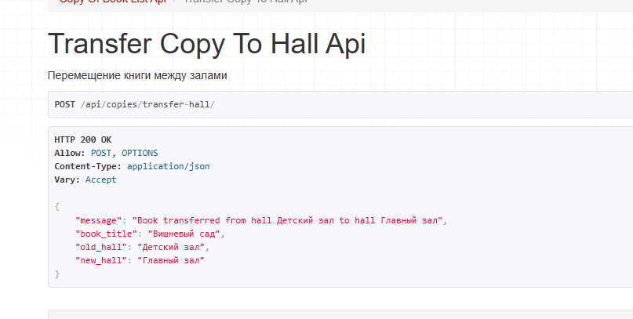
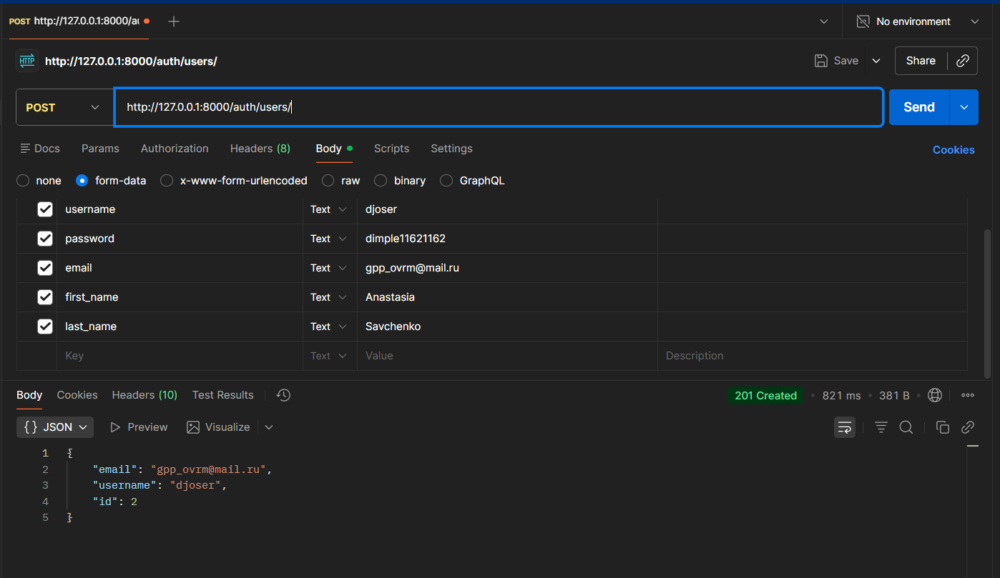
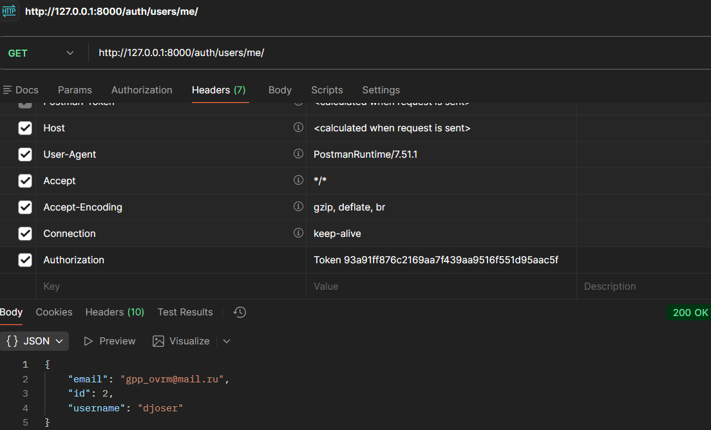

# Лабораторная работа 3. Реализация серверной части на django rest. Документирование API.

## Цель

работы: овладеть практическими навыками реализации серверной части (backend) приложений средствами Django REST framework.

??? note "Вариант 2: Библиотека"

    Создать программную систему, предназначенную для работников библиотеки.
    Такая система должна обеспечивать хранение сведений об имеющихся в библиотеке
    книгах, о читателях библиотеки и читальных залах.
    
    Для каждой книги в БД должны храниться следующие сведения: название книги,
    автор (ы), издательство, год издания, раздел, число экземпляров этой книги в каждом зале
    библиотеки, а также шифр книги и дата закрепления книги за читателем. Книги могут
    перерегистрироваться в другом зале.
    
    Сведения о читателях библиотеки должны включать номер читательского билета,
    ФИО читателя, номер паспорта, дату рождения, адрес, номер телефона, образование,
    наличие ученой степени.
    
    Читатели закрепляются за определенным залом, могут переписаться в другой зал и
    могут записываться и выписываться из библиотеки.
    
    Библиотека имеет несколько читальных залов, которые характеризуются номером,
    названием и вместимостью, то есть количеством людей, которые могут одновременно
    работать в зале.
    
    Библиотека может получать новые книги и списывать старые. Шифр книги может
    измениться в результате переклассификации, а номер читательского билета в результате
    перерегистрации.
    
    Библиотекарю могут потребоваться следующие сведения о текущем состоянии
    библиотеки:
    
    * Какие книги закреплены за заданным читателем?
      * Кто из читателей взял книгу более месяца тому назад?
      * За кем из читателей закреплены книги, количество экземпляров которых в
      библиотеке не превышает 2?
      * Сколько в библиотеке читателей младше 20 лет?
      * Сколько читателей в процентном отношении имеют начальное образование,
      среднее, высшее, ученую степень?
    
    Библиотекарь может выполнять следующие операции:
    
    * Записать в библиотеку нового читателя.
      * Исключить из списка читателей людей, записавшихся в библиотеку более года
      назад и не прошедших перерегистрацию.
      * Списать старую или потерянную книгу.
      * Принять книгу в фонд библиотеки.
    
    Необходимо предусмотреть возможность выдачи отчета о работе библиотеки в
    течение месяца. Отчет должен включать в себя следующую информацию: количество
    книг и читателей на каждый день в каждом из залов и в библиотеке в целом, количество
    читателей, записавшихся в библиотеку в каждый зал и в библиотеку за отчетный месяц.

## Проектирование БД в соот с ТЗ


### Для книг (Book + CopyOfBook)

=== "Основные сведения о книгах"
    - **Название книги** - `Book.title`
    - **Автор(ы)** - `Author` + `BookAuthor` (связь M:M)
    - **Издательство** - `Book.publisher`
    - **Год издания** - `Book.publication_year`
    - **Раздел** - `Book.section`
    - **Шифр книги** - `Book.inventory_code`

=== "Учет экземпляров и перемещение"
    - **Число экземпляров в каждом зале** - считается через `CopyOfBook` по `book_id` и `hall_id`
    - **Книги могут перерегистрироваться в другом зале** - изменение `CopyOfBook.hall_id`
    - **Шифр книги может измениться** - изменение `Book.inventory_code`

=== "Операции с фондом"
    - **Библиотека может получать новые книги** - добавление в `Book` и `CopyOfBook`
    - **Списывать старые** - `CopyOfBook.decommission_date` + `Book.is_in_catalog`
    - **Дата закрепления за читателем** - `LoanRecord.issued_at`

### Для читателей (Reader)

=== "Персональные данные"
    - **Номер читательского билета** - `Reader.library_card_id`
    - **ФИО читателя** - `Reader.full_name`
    - **Номер паспорта** - `Reader.passport`
    - **Дата рождения** - `Reader.birth_date`
    - **Адрес** - `Reader.home_address`
    - **Номер телефона** - `Reader.phone_number`

=== "Образование и статус"
    - **Образование, наличие ученой степени** - `Reader.education_level`
    - **Закрепление за определенным залом** - `Reader.hall_id`
    - **Могут записываться и выписываться** - `Reader.is_active_member`

=== "Изменения данных"
    - **Могут переписаться в другой зал** - изменение `Reader.hall_id`
    - **Номер читательского билета может измениться** - изменение `Reader.library_card_id`

### Для читальных залов (ReadingHall)

=== "Характеристики залов"
    - **Номер зала** - `ReadingHall.hall_number`
    - **Название** - `ReadingHall.name`
    - **Вместимость** - `ReadingHall.capacity`

### Для операций библиотекаря

=== "Запросы о текущем состоянии"
    - **Какие книги закреплены за заданным читателем?** - `LoanRecord` + `Book`
    - **Кто из читателей взял книгу более месяца тому назад?** - `LoanRecord.issued_at`
    - **За кем из читателей закреплены редкие книги (≤2 экз.)?** - `CopyOfBook` + `LoanRecord`
    - **Сколько читателей младше 20 лет?** - `Reader.birth_date`
    - **Процент читателей по образованию** - `Reader.education_level`

=== "Основные операции"
    - **Записать нового читателя** - INSERT в `Reader`
    - **Исключить неактивных** - `Reader.last_registration_at` > 1 года
    - **Списать книгу** - `CopyOfBook.decommission_date`
    - **Принять книгу в фонд** - INSERT в `Book`/`CopyOfBook`

### Для отчетов

=== "Статистика и учет"
    - **Количество книг и читателей по залам** - `CopyOfBook` + `Reader` + `ReadingHall`
    - **Количество читателей, записавшихся за месяц** - `Reader.first_registered_at`

### Ограничения значений полей

=== "CopyOfBook.availability_status"
    Возможные значения:
    - `available` - доступен
    - `on_loan` - выдан
    - `reserved` - зарезервирован
    - `decommissioned` - списан

=== "CopyOfBook.copy_condition"
    Возможные значения:
    - `excellent` - отличное
    - `good` - хорошее
    - `fair` - удовлетворительное
    - `poor` - плохое
    - `damaged` - поврежден

=== "Reader.education_level"
    Возможные значения:
    - `primary` - начальное
    - `secondary` - среднее
    - `higher` - высшее
    - `degree` - ученая степень

## Реализация серверной части приложения средствами Django и Django REST Framework

### 1. Реализация логики работы API средствами Django REST Framework

#### 1.1. Использование методов сериализации (как в Практической 3.1, пункты 4-6)

Для преобразования данных моделей Django в формат JSON и обратно были использованы сериализаторы Django REST Framework:

``` python
# serializers.py
from rest_framework import serializers
from .models import *

class AuthorSerializer(serializers.ModelSerializer):
    class Meta:
        model = Author
        fields = '__all__'

class BookSerializer(serializers.ModelSerializer):
    class Meta:
        model = Book
        fields = '__all__'

class ReaderSerializer(serializers.ModelSerializer):
    class Meta:
        model = Reader
        fields = '__all__'
        read_only_fields = [
            'library_card_id',
            'first_registered_at',
            'reader_id'
        ]
        extra_kwargs = {
            'is_active_member': {'default': True},
        }
```

**Объяснение:**
- Использован `ModelSerializer` для автоматической генерации полей на основе модели
- `fields = '__all__'` включает все поля модели в сериализацию
- `read_only_fields` определяет поля, которые нельзя изменять через API
- `extra_kwargs` позволяет задать дополнительные параметры для полей

#### 1.2. APIView классы (из практической 3.2)

Для реализации сложной бизнес-логики были использованы классы `APIView`:

``` python
# views.py
from rest_framework.views import APIView
from rest_framework.response import Response

class ReaderBooksAPIView(APIView):
    """1. Какие книги закреплены за заданным читателем?"""

    def get(self, request, pk):
        try:
            reader = Reader.objects.get(pk=pk)
            loans = LoanRecord.objects.filter(reader_id=reader, returned_at__isnull=True)
            # ... обработка данных
            return Response({
                'reader': serializer.data,
                'books': books
            })
        except Reader.DoesNotExist:
            return Response({'error': 'Reader not found'})
```

**Объяснение:**
- `APIView` предоставляет гибкий способ создания представлений
- Методы `get()`, `post()` соответствуют HTTP-методам
- Используется `Response` для возврата данных в формате JSON
- Обработка исключений обеспечивает надежность API

#### 1.3. Generic классы (из практической 3.2)

Для стандартных операций CRUD использованы Generic классы:

``` python
from rest_framework import generics

class BookListAPIView(generics.ListAPIView):
    """Список книг"""
    serializer_class = BookSerializer
    queryset = Book.objects.filter(is_in_catalog=True)

class RegisterReaderAPIView(generics.CreateAPIView):
    """6. Зарегистрировать нового читателя"""
    serializer_class = ReaderSerializer
```

**Объяснение:**
- `ListAPIView` для получения списка объектов
- `CreateAPIView` для создания новых объектов
- Минимальный код + автоматическая валидация и сериализация данных

#### 1.4. Работа с Django ORM (из Практической 3.1)

Для выполнения запросов к базе данных использованы методы Django ORM:

``` python
# Примеры запросов из разных эндпоинтов:

# Фильтрация с Q-объектами
books = CopyOfBook.objects.filter(
    hall_id=hall,
    received_date__lte=current
).exclude(
    Q(decommission_date__lte=current) |
    Q(availability_status='decommissioned')
).count()

# Агрегация и аннотация
stats = []
for level_code, level_name in Reader.EDUCATION_CHOICES:
    count = Reader.objects.filter(
        education_level=level_code,
        is_active_member=True
    ).count()
    percentage = (count / total) * 100 if total > 0 else 0

# Сложные цепочки фильтров
overdue_loans = LoanRecord.objects.filter(
    issued_at__lt=month_ago,
    returned_at__isnull=True
)
```

**Объяснение:**
- Использованы `filter()`, `exclude()` для выборки данных
- Применены Q-объекты для сложных условий
- Агрегация (`count()`, `sum()`) для статистических вычислений
- Цепочки методов для построения сложных запросов

### 2. Реализованные эндпоинты API

#### 2.1. Пять GET-запросов информации для библиотекаря:

1. **`GET /api/reader/<int:pk>/books/`** (http://127.0.0.1:8000/api/reader/20/books/) - **1. Какие книги закреплены за заданным читателем?**

Дополнительно исп. серриализатор для вывода всей инфы о читателе.

??? info "Ответ"

    {
        "reader": {
            "reader_id": 18,
            "library_card_id": "Б-26-0001",
            "full_name": "Иванов Иван Иванович",
            "birth_date": "2000-05-15",
            "education_level": "higher",
            "passport": "1234 567890",
            "phone_number": "+7 (123) 456-78-90",
            "home_address": "г. Москва, ул. Ленина, д. 1",
            "is_active_member": true,
            "first_registered_at": "2026-02-04",
            "last_registration_at": "2025-08-08",
            "hall_id": 12
        },
        "books": [
            {
                "title": "Война и мир",
                "author": "Лев Толстой",
                "issued_at": "2026-01-01",
                "due_date": "2026-01-25"
            },
            {
                "title": "Война и мир",
                "author": "Лев Толстой",
                "issued_at": "2026-01-10",
                "due_date": "2026-02-14"
            }
        ]
    }

2. **`GET /api/loans/overdue/`** (http://127.0.0.1:8000/api/loans/overdue/) - **2. Кто из читателей взял книгу более месяца тому назад?**

Выведет читателя и его id с просроченными книгами (+ id экземпляра)

??? info "Ответ"

    {
        "overdue_readers": [
            {
                "reader_id": 18,
                "reader_name": "Иванов Иван Иванович",
                "book_title": "Война и мир",
                "issued_at": "2026-01-01",
                "days_overdue": 34
            },
            {
                "reader_id": 23,
                "reader_name": "Смирнов Дмитрий Петрович",
                "book_title": "Анна Каренина",
                "issued_at": "2025-12-20",
                "days_overdue": 46
            }
        ]
    }

3. **`GET /api/readers/rare-books/`** (http://127.0.0.1:8000/api/readers/rare-books/) - **3. За кем из читателей закреплены редкие книги (≤2 экз.)?**
  
Сначала находим все книги с двумя или меньше доступными экземплярами, аннотируя каждую книгу количеством её копий. Затем для каждой такой редкой книги находим читателей, у которых есть активные выдачи этих книг, и возвращаем информацию о них.

4. **`GET /api/readers/young/`** (http://127.0.0.1:8000/api/readers/young/) - **4. Сколько в библиотеке читателей младше 20 лет?**
   
Через фильтрацию по дате рождения и возвращает их **количество** вместе с детальной информацией в сериализованном виде.

??? info "Код"

    class YoungReadersAPIView(APIView):
        """4. Сколько в библиотеке читателей младше 20 лет?"""
    
        def get(self, request):
            twenty_years_ago = date.today() - timedelta(days=20 * 365)
    
            young_readers = Reader.objects.filter(
                birth_date__gt=twenty_years_ago,
                is_active_member=True
            )
    
            serializer = ReaderSerializer(young_readers, many=True)
            return Response({
                'count': young_readers.count(),
                'readers': serializer.data # для сокращения кода
            })


5. **`GET /api/stats/education/`** (http://127.0.0.1:8000/api/stats/education/) - **5. Сколько читателей в процентном отношении имеют начальное образование, среднее, высшее, ученую степень?**
  
??? info "Ответ"

    {
        "total_readers": 5,
        "stats": [
            {
                "education": "Начальное",
                "count": 2,
                "percentage": 40.0
            },
            {
                "education": "Среднее",
                "count": 0,
                "percentage": 0.0
            },
            {
                "education": "Высшее",
                "count": 3,
                "percentage": 60.0
            },
            {
                "education": "Ученая степень",
                "count": 0,
                "percentage": 0.0
            }
        ]
    }

#### 2.2. Четыре POST-операции библиотекаря:

6. **`POST /api/reader/register/`** (http://127.0.0.1:8000/api/reader/register/) - **6. Записать в библиотеку нового читателя**
  


7. **`POST /api/readers/remove-inactive/`** (http://127.0.0.1:8000/api/readers/remove-inactive/) - **7. Исключить из списка читателей людей, записавшихся в библиотеку более года назад и не прошедших перерегистрацию**
 
8. **`POST /api/books/decommission/`** (http://127.0.0.1:8000/api/books/decommission/) - **8. Списать старую или потерянную книгу**
   
Для удаления нужно ввести id экземпляра (через браузер {"copy_id": 64}). В случае если книга в данный момент выдана вернется исключение. 


9. **`POST /api/books/add/`** (http://127.0.0.1:8000/api/books/add/) - **9. Принять книгу в фонд библиотеки**
   
#### 2.3. Дополнительные эндпоинты (не прописаны, но упомянуты в варианте):

10. **`GET /api/reports/monthly/`** (http://127.0.0.1:8000/api/reports/monthly/) - **Отчет о работе библиотеки за месяц**
    
11. **`POST /api/copies/transfer-hall/`** (http://127.0.0.1:8000/api/copies/transfer-hall/) - **Перемещение книги между залами** (Книги могут перерегистрироваться в другом зале)
   




12. **`POST /api/books/<int:pk>/update-code/`** (http://127.0.0.1:8000/api/books/20/update-code/) - **Изменение шифра книги** (Шифр книги может измениться в результате переклассификации)


#### 2.4. Вспомогательные эндпоинты:

13. **`GET /api/books/`** (http://127.0.0.1:8000/api/books/) - Список всех книг в каталоге
14. **`GET /api/readers/`** (http://127.0.0.1:8000/api/readers/) - Список активных читателей
15. **`GET /api/copies/`** (http://127.0.0.1:8000/api/copies/) - Список доступных экземпляров книг

### 3. Архитектура приложения

```
library_project/
├── library_app/
│   ├── models.py          # Модели данных
│   ├── serializers.py     # Сериализаторы DRF
│   ├── views.py          # Представления (APIView + Generic)
│   └── urls.py           # Маршрутизация API
├── library_project/
│   ├── settings.py       # Настройки Django + DRF + Djoser
│   └── urls.py          # Основные URL-маршруты
└── db.sqlite3           # База данных
```

## Подключить регистрацию / авторизацию по токенам / вывод информации о текущем пользователе средствами Djoser.

### Подключить регистрацию / авторизацию по токенам

``` py title="settings.py" 
INSTALLED_APPS = [
    ...
    'djoser',  # подкл djoser пункт 5
    'rest_framework.authtoken',  # покл авторизацию по токенам
]
```

``` py title="usrl.py" 
urlpatterns = [
    ...
    path('auth/', include('djoser.urls')),
    path('auth/', include('djoser.urls.authtoken')), # покл url адреса для работы с токенами
]
```



### Получение токена

Эндпойнт /auth/token/login/ (Token Based Authentication)


### Запрос и получение информации о пользователе**

Для того чтобы показать серверу, что мы именно этот user нужно отправить ему полученный токен серверу вместе с запросом который выполняем



## Заключение

Эта лабораторная работа позволила применить знания из практических работ и реализовать серверную часть приложения для библиотеки средствами Django. Была создана модель базы данных согласно варианту, и на её основе, а также по заданиям из варианта, были реализованы требуемые эндпоинты: некоторые из них были простыми (generic), логику других пришлось разрабатывать отдельно. Также я познакомилась с инструментом тестирования API Postman. Запросы я в основном тестировала в браузере, но потом попробовала и через Postman. Кроме того, с его помощью была настроена регистрация и получение токена средствами djoser.