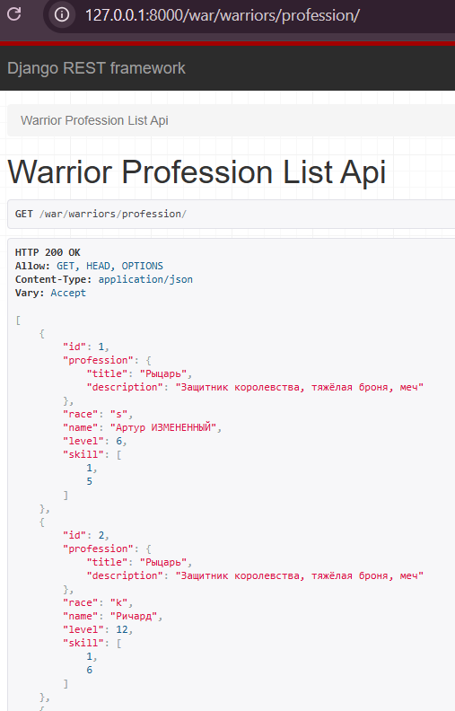
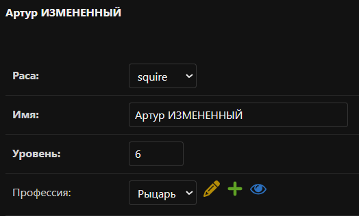

# Практическая работа №3.2

**Тема:** Django REST Framework. Создание API.  
**Цель работы:** получить представление об использовании возможностей контроллеров и сериализаторов в Django REST
Framework (DRF).

---

## 1. Настройка проекта и приложения

Был создан новый Django-проект `warriors_project` и приложение `warriors_app`.  
Установлены необходимые библиотеки:

```bash
pip install django djangorestframework
```

В `settings.py` добавлены:

``` py title="settings.py" 
INSTALLED_APPS = [
    ...
    'rest_framework',
    'warriors_app',
]
```

Выполнены миграции и создан суперпользователь для доступа к админке:

```bash
python manage.py migrate

python manage.py createsuperuser
```

---

## 2. Модели данных

Созданы модели в тематике средневековых воинов:

``` py title="warriors_app/models.py" 
class Warrior(models.Model):
    race_types = (
        ('s', 'squire'),
        ('k', 'knight'),
        ('m', 'mage'),
    )
    race = models.CharField(max_length=1, choices=race_types)
    name = models.CharField(max_length=120)
    level = models.IntegerField(default=0)
    skill = models.ManyToManyField('Skill', through='SkillOfWarrior')
    profession = models.ForeignKey('Profession', on_delete=models.CASCADE, null=True, blank=True)


class Profession(models.Model):
    title = models.CharField(max_length=120)
    description = models.TextField()


class Skill(models.Model):
    title = models.CharField(max_length=120)


class SkillOfWarrior(models.Model):
    skill = models.ForeignKey('Skill', on_delete=models.CASCADE)
    warrior = models.ForeignKey('Warrior', on_delete=models.CASCADE)
    level = models.IntegerField()
```

---

## 3. Сериализаторы

В `warriors_app/serializers.py` созданы сериализаторы:

- **WarriorSerializer** – базовый для воина
- **ProfessionCreateSerializer** – для создания профессии
- **SkillSerializer** – для навыков
- **WarriorProfessionSerializer** – воин с вложенной профессией
- **WarriorSkillSerializer** – воин с вложенными навыками
- **WarriorDetailSerializer** – детальная информация (профессия + навыки)

Пример вложенного сериализатора:

``` python
class WarriorProfessionSerializer(serializers.ModelSerializer):
    profession = ProfessionSerializer(read_only=True)

    class Meta:
        model = Warrior
        fields = "__all__"
```

---

## 4. Представления (APIView и Generics)

### 4.1. APIView (ручная реализация)

``` py title="warriors_app/views.py" 
class SkillAPIView(APIView):
    def get(self, request):
        skills = Skill.objects.all()
        serializer = SkillSerializer(skills, many=True)
        return Response({"Skills": serializer.data})

    def post(self, request):
        skill = request.data.get("skill")
        serializer = SkillSerializer(data=skill)
        if serializer.is_valid(raise_exception=True):
            skill_saved = serializer.save()
        return Response({"Success": f"Skill '{skill_saved.title}' created."})
```

**Проверка:**

- GET /war/skills/ (http://127.0.0.1:8000/war/skills/) – возвращает список навыков.
- POST /war/skills/ (http://127.0.0.1:8000/war/skills/)– создаёт новый навык.

---

### 4.2. Generic-представления

Использованы для сокращения кода:

``` py title="views.py" 
class WarriorListAPIView(generics.ListAPIView):
    serializer_class = WarriorSerializer
    queryset = Warrior.objects.all()


class ProfessionCreateAPIView(generics.CreateAPIView):
    serializer_class = ProfessionCreateSerializer
    queryset = Profession.objects.all()
```

---

## 5. Практическое задание: реализация эндпоинтов

### Задание 1: Вывод всех воинов с профессиями

**Код:**

``` python
class WarriorProfessionListAPIView(generics.ListAPIView):
    queryset = Warrior.objects.all()
    serializer_class = WarriorProfessionSerializer
```

**URL:** `GET /war/warriors/profession/` (http://127.0.0.1:8000/war/warriors/profession/)  
**Ответ:**  

*Воин с вложенным объектом профессии*
---

### Задание 2: Вывод всех воинов с навыками

**Код:**

``` python
class WarriorSkillListAPIView(generics.ListAPIView):
    queryset = Warrior.objects.all()
    serializer_class = WarriorSkillSerializer
```

**URL:** `GET /war/warriors/skill/` (http://127.0.0.1:8000/war/warriors/skill/)  
**Ответ:**  

*Воин с массивом навыков*

---

### Задание 3: Детальная информация о воине по ID

**Код:**

``` python
class WarriorRetrieveAPIView(generics.RetrieveAPIView):
    queryset = Warrior.objects.all()
    serializer_class = WarriorDetailSerializer
```

**URL:** `GET /war/warriors/<id>/` (http://127.0.0.1:8000/war/warriors/1/)
**Ответ для ID=1:**

``` json
{
  "id": 1,
  "profession": {
    "title": "Рыцарь",
    "description": "Защитник королевства, тяжёлая броня, меч"
  },
  "skill": [
    {
      "id": 1,
      "title": "Владение мечом"
    },
    {
      "id": 5,
      "title": "Тактика"
    }
  ],
  "race": "s",
  "name": "Артур",
  "level": 5
}
```

---

### Задание 4: Удаление воина по ID

**Код:**

``` python
class WarriorDestroyAPIView(generics.DestroyAPIView):
    queryset = Warrior.objects.all()
    serializer_class = WarriorSerializer
```

**URL:** `DELETE /war/warriors/delete/<id>/` (http://127.0.0.1:8000/war/warriors/delete/1/)  
**Проверка: При отправке DELETE-запроса (например, через DRF Browsable API или Postman) воин успешно удаляется:

``` text
[03/Feb/2026 23:51:29] "DELETE /war/warriors/delete/4/ HTTP/1.1" 200 9786
```

---

### Задание 5: Редактирование воина

**Код:**

``` python
class WarriorUpdateAPIView(generics.UpdateAPIView):
    serializer_class = WarriorSerializer
    queryset = Warrior.objects.all()
```

**URL:** `PATCH /war/warriors/update/<id>/` (http://127.0.0.1:8000/war/warriors/update/1/)  
**Пример обновления:** Изменены имя и уровень воина через форму DRF.

---

## 6. Маршрутизация

В `warriors_app/urls.py`:

``` python
urlpatterns = [
    # generic
    path('warriors/list/', WarriorListAPIView.as_view()),
    path('profession/generic_create/', ProfessionCreateAPIView.as_view()),

    # APIView
    path('skills/', SkillAPIView.as_view()),

    # эндпоинты из практического задания
    path('warriors/profession/', WarriorProfessionListAPIView.as_view()),
    path('warriors/skill/', WarriorSkillListAPIView.as_view()),
    path('warriors/<int:pk>/', WarriorRetrieveAPIView.as_view()),
    path('warriors/delete/<int:pk>/', WarriorDestroyAPIView.as_view()),
    path('warriors/update/<int:pk>/', WarriorUpdateAPIView.as_view()),
]
```

---

## Полученные эндпоинты по заданию

Все эндпоинты, требуемые в практическом задании, были успешно реализованы и протестированы:

### 1. Вывод полной информации о всех войнах и их профессиях (в одном запросе)

**Эндпоинт:** `GET /war/warriors/profession/`  
**URL:** http://127.0.0.1:8000/war/warriors/profession/  
**Описание:** Возвращает список всех воинов с вложенными объектами их профессий, включая название и описание.

### 2. Вывод полной информации о всех войнах и их скилах (в одном запросе)

**Эндпоинт:** `GET /war/warriors/skill/`  
**URL:** http://127.0.0.1:8000/war/warriors/skill/  
**Описание:** Возвращает список всех воинов с вложенными массивами их навыков, включая ID и название каждого навыка.

### 3. Вывод полной информации о войне (по id), его профессиях и скилах

**Эндпоинт:** `GET /war/warriors/<id>/`  
**URL:** http://127.0.0.1:8000/war/warriors/1/  
**Описание:** Возвращает детальную информацию о конкретном воине по его ID, включая полные данные о профессии и всех
связанных навыках.

### 4. Удаление война по id

**Эндпоинт:** `DELETE /war/warriors/delete/<id>/`  
**URL:** http://127.0.0.1:8000/war/warriors/delete/4/  
**Описание:** Полностью удаляет воина из базы данных по указанному ID. Возвращает статус 204 No Content при успешном
выполнении.

### 5. Редактирование информации о войне

**Эндпоинт:** `PATCH /war/warriors/update/<id>/`  
**URL:** http://127.0.0.1:8000/war/warriors/update/1/  
**Описание:** Позволяет частично обновить информацию о воине (имя, уровень, расу, профессию, навыки) по его ID.

---

## Дополнительные реализованные эндпоинты

Помимо основных требований задания, были также реализованы следующие эндпоинты:

### 6. Базовый список всех воинов

**Эндпоинт:** `GET /war/warriors/list/`  
**URL:** http://127.0.0.1:8000/war/warriors/list/  
**Описание:** Возвращает плоский список всех воинов без вложенных данных о профессиях и навыках.

### 7. Создание профессии через Generic API

**Эндпоинт:** `POST /war/profession/generic_create/`  
**URL:** http://127.0.0.1:8000/war/profession/generic_create/  
**Описание:** Создание новой профессии с использованием Generic CreateAPIView.

### 8. Работа с навыками (APIView)

**Эндпоинт:**

- `GET /war/skills/` – получение списка всех навыков
- `POST /war/skills/` – создание нового навыка  
  **URL:** http://127.0.0.1:8000/war/skills/  
  **Описание:** Реализация CRUD для навыков с использованием ручного APIView.

Все эндпоинты были протестированы через DRF Browsable API и работают корректно.

## 8. Заключение

В ходе практической работы я научилась создавать RESTful API с использованием Django REST Framework. Были освоены
принципы построения моделей данных с отношениями, работа с сериализаторами, включая вложенные структуры для отображения
связанных данных. Я реализовала представления как вручную через APIView, так и с использованием Generic-классов, что
позволило сократить объём кода. Были созданы эндпоинты для выполнения всех CRUD-операций:получение
списка воинов с профессиями и навыками, детальная информация о конкретном воине, его обновление и удаление. Все
эндпоинты протестированы через браузерный интерфейс DRF и работают корректно.